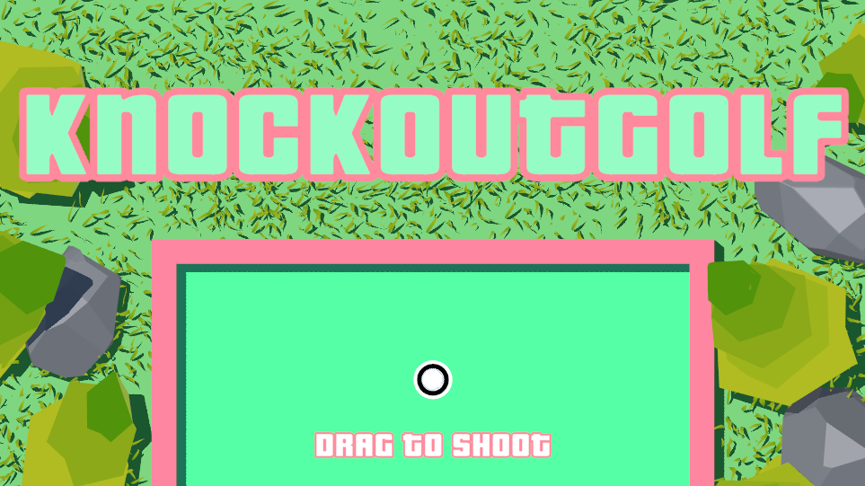
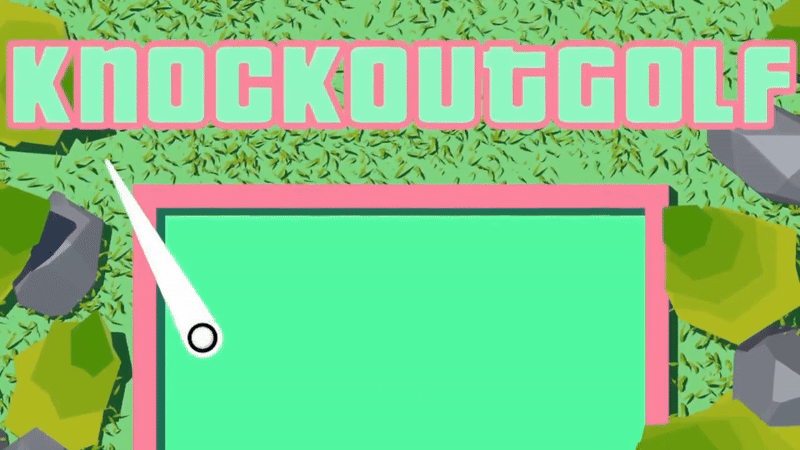
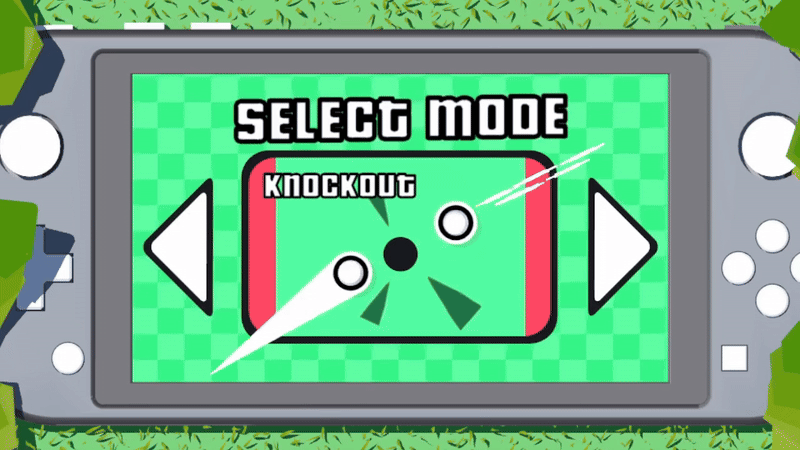
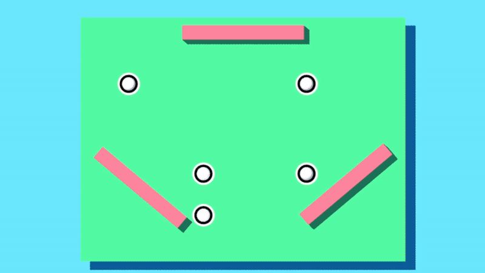
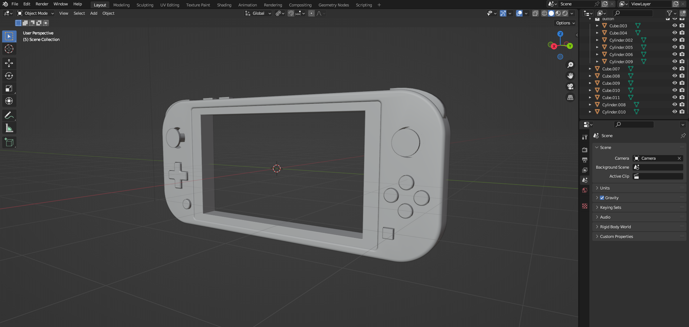
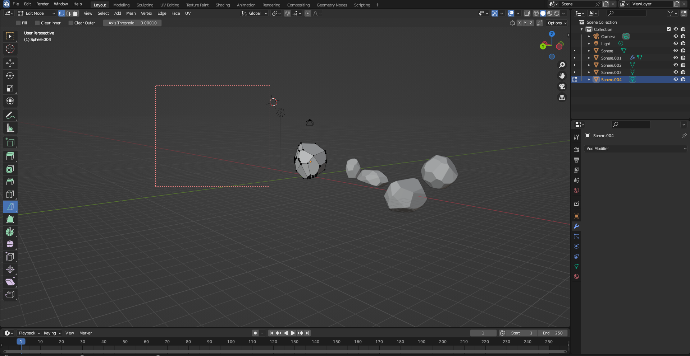
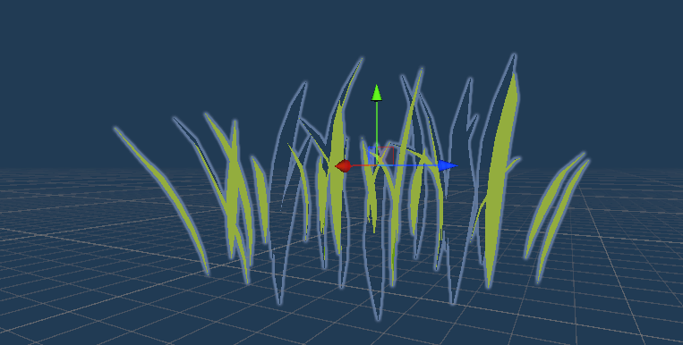
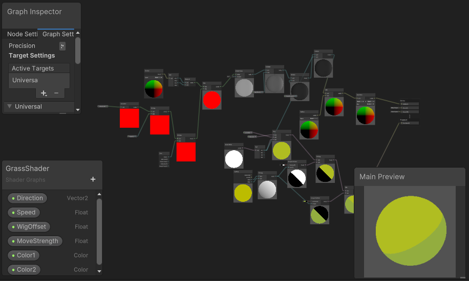

# knockout-golf
Knockout Golf is a chaotic local multiplayer party game where players drag, aim, and launch themselves like golf balls in fast-paced arenas. With no cooldowns and no limits, it's pure mayhem: whether you're knocking opponents off the stage or racing to the finish line, you will be  constantly colliding with the opponent. Designed for local  multiplayer, the game combines mechanical precision with unpredictable physics, offering endless fun and competitive chaos.

  

Originally developed using Plastic SCM and now fully migrated to GitHub, Knockout Golf was built in Unity using C# with Visual Studio as the main IDE. The visuals were crafted with Blender and enhanced through Unity’s Universal Render Pipeline (URP), bringing clean lighting and stylized effects to life. Key tools and packages include LeanTween for smooth animations and TextMeshPro for high-quality in-game text rendering. The result is a lightweight, fast-paced experience built to maximize both polish and fun in every match.

##  Gameplay
- Physics-based flick/shoot mechanic to launch your ball
- Local multiplayer
- Knockout mode: push opponents off the stage
- Race mode: be the first to cross the finish line
- Dynamic arenas with obstacles and powerups

##  Demo / Screenshots

  

##  Visual Design

Blender was used to create 3D models in order to maintain consistent and vibrant visuals.
  

Custom shaders were created in Unity's Shader Graph to add dynamic feedback and polish.
  

## 🛠️ Tech Stack

This project was developed using the following tools and technologies:

| Category             | Tool / Technology                                                               |
|----------------------|----------------------------------------------------------------------------------|
| Game Engine          | [Unity](https://unity.com/) (Universal Render Pipeline - URP)                   |
| Programming Language | C#                                                                               |
| Visual Effects       | Shader Graph, Unity URP Materials                                                |
| 3D Modeling          | [Blender](https://www.blender.org/)                                              |
| Version Control      | Git, [GitHub](https://github.com/), previously Plastic SCM                       |
| Other Libraries      | TextMeshPro, LeanTween, Unity 2D Animation, Unity Tilemap, and many more         |

## License

This project is licensed under the MIT License. See the [LICENSE](LICENSE) file for details.

